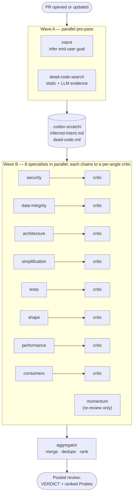

# knightwatch-reviewer

An AI code reviewer that traces causality across files, not patterns within them.

## What's different

Most AI reviewers do single-file pattern matching. Useful, but they miss bugs that only emerge from how files and systems interact.

Here's a real PR that switched the production database from password auth to RDS IAM tokens. GitHub Copilot's reviewer commented on three single-file patterns. The most substantive of the three:

**Copilot, inline on `api/svc/db/session.py`:**
> `sslmode=require` encrypts the connection but does not verify the server certificate/hostname in Postgres, so it's vulnerable to MITM within the network. Consider `sslmode=verify-full`…

Reasonable. But that's a hardening note, not a finding that would stop the merge.

**Knightwatch's review on the same PR:**
> **[blocking]** IAM rollout would crash the API at startup. `entrypoint.sh` runs `migrate up` before the web server, but `migrations/env.py` builds a plain engine without the IAM hook (which is only wired into `build_runtime_engine`). Since `infra/locals.tf` removes the legacy password env var, the migration step would attempt passwordless auth as `svc_app` and the API would never boot. Reuse `get_migration_connection()` so the migration path and runtime obtain credentials the same way.

The bug isn't visible in any single file. It only shows up when you stitch shell startup + the migration engine builder + the infra env config + the location of the IAM hook. That's the kind of catch knightwatch is designed for.

Two more, from the public [`tkmx-client`](https://github.com/srosro/tkmx-client) reporter:

- **[#19 — legacy daemons would silently stop after `git pull`](https://github.com/srosro/tkmx-client/pull/19#issuecomment-4357873121)**. Deleting `reporter/report.js` and pointing new installs at `dist/reporter/report.js` would leave already-installed launchd/systemd units calling the removed path, because the documented update path is `git pull && npm install` and that doesn't rerun `install-service`. Caught by stitching the diff against the install script, the README's update instructions, and the systemd/launchd unit `ExecStart=` that reaches into the source tree.
- **[#19 — recurring schema-ownership drift](https://github.com/srosro/tkmx-client/pull/19#issuecomment-4358179972)**. Flagged the third instance of the same DTO-ownership class — each new consumer re-deriving usage shapes from `agentsview` rather than one neutral seam — and asked for a refactor at the right level instead of another local patch. Fixed by extracting `reporter/usage.ts` as the single owner.

## How it works

A timer polls tracked repos for new or updated PRs. For each, it runs a two-wave pipeline:

- **Wave A** (parallel): two **standalone** stages — `intent` (infers the end-user-facing outcome the PR is reaching for) and `dead-code-search` (pre-pass static + LLM evidence). Both seed scratch inputs the next wave reads.
- **Wave B** (parallel): the eight **specialists** — `performance`, `security`, `data-integrity`, `architecture`, `consumers`, `shape`, `simplification`, `tests` — each looking at one angle of the diff against the rest of the repo. On re-reviews, the `momentum` standalone joins Wave B (it tracks LOC trajectory and prior-round drift). Each specialist emits structured **probes** (hypothesis + severity + class), and a per-angle `critic` then resolves each probe (`Answer: yes/no/unknown` + evidence).
- **Aggregator** (sequential): renders a single ranked **Probes** section with `[from: <specialist>]` attribution, a verdict (`APPROVE` or one or more blocking probes), and an AI-author callout so Codex/Claude Code/Cursor can parse load-bearing open probes directly. A marker (`<!-- knightwatch-reviewer:auto-post -->`) tags every post so reply automation and human babysitting can filter cleanly.



The bot signs as a real GitHub user, so reviews appear under that account.

## Install

```sh
git clone git@github.com:srosro/knightwatch-reviewer.git
cd knightwatch-reviewer
./install.sh
```

`install.sh` symlinks scripts into `~/.pr-reviewer/`, copies the `systemd/*.{service,timer}` files into `/etc/systemd/system/`, daemon-reloads, and enables the timers. Idempotent — re-run after pulling changes.

Single-tenant by design: one Linux host with `gh` authenticated as the bot's signing user. The systemd units currently bake in `User=odio` and `/home/odio/.pr-reviewer/`; edit them for a different user or path.

## Configure repos

The tracked-repo manifest is split into a committed template ([`repos.conf.example`](repos.conf.example)) and a per-operator live file (`repos.conf`, gitignored). On first `./install.sh` run the live file is bootstrapped from the template — edit it in place, then re-run `./install.sh`:

```sh
REPOS=(
    "your-org/your-repo"
    ...
)
```

The next 2-minute timer tick picks it up. `SOURCE_PATHS` in the same file enables cross-repo grep/search-roots and `KID_PATHS` wires kid-prior-art lookup. Per-repo policy (product context, review priority, sibling allowlist, dead-code command, strict-typing command) lives in each tracked repo's `.knightwatch/` directory and is read from the base branch via `lib/knightwatch-config.sh`. See the inline comments in [`repos.conf.example`](repos.conf.example) for shapes and `lib/tracked-repos.sh` for the loader.

## Use on a PR

Reviews fire on PR open and again after one hour of idle. To force a fresh review on the new head, post a slash command:

| Command | What |
|---|---|
| `/srosro-update-review` | Incremental re-review against the prior reviewed SHA |
| `/srosro-review` | Whole-PR re-review from scratch |
| `/srosro-approve` | Approve the PR (push-access collaborators only) |
| `/srosro-memorize` | Teach the bot a calibration lesson from your reply |

### Specialist bake-off

A small post-hoc measurement that helps decide which specialists are earning their place. `specialist-bakeoff.sh` runs hourly via systemd (`*:30`), walks the tracked repos in `repos.conf`, parses posted bot reviews on GitHub, and writes a markdown table to `~/.pr-reviewer/specialist-bakeoff.md` with three columns per specialist over a rolling 30-day window:

- **Shipped** — count of `[from: <specialist>]` attributions in posted reviews.
- **Loved** — count of `/srosro-memorize` comments by trusted (push-access) collaborators that quoted a `[from: <specialist>]` tag from a prior bot review. To credit a specialist when you memorize, **quote the tag** (e.g. `[from: simplification]`) in your memorize body. Quote tags for positive feedback only — the parser counts attributions, not sentiment.
- **Loved/Shipped** — ratio (small-but-mighty vs high-volume-low-value).

Use it to inform collapse-or-keep decisions on specialist agents.

See `docs/specialist-bakeoff-sample.md` for an example snapshot.

## Repo layout

- `review.sh` / `lib/review-one-pr.sh` — per-PR review driver
- `prompts/` — specialist + critic + aggregator prompts
- `systemd/` — polling timer + service units
- `repos.conf.example` — tracked-repo manifest template (live `repos.conf` is per-operator, gitignored)
