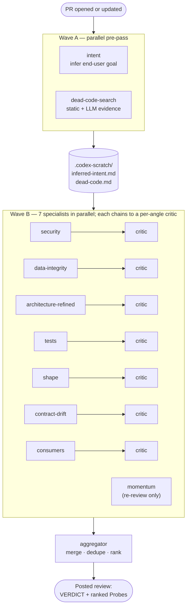

# knightwatch-reviewer

An AI code reviewer that traces causality across files, not patterns within them.

## What's different

Most AI reviewers do single-file pattern matching. Useful, but they miss bugs that only emerge from how files and systems interact.

Here's a real PR that switched the production database from password auth to RDS IAM tokens. GitHub Copilot's reviewer commented on three single-file patterns. The most substantive of the three:

**Copilot, inline on `api/svc/db/session.py`:**
> `sslmode=require` encrypts the connection but does not verify the server certificate/hostname in Postgres, so it's vulnerable to MITM within the network. Consider `sslmode=verify-full`…

Reasonable. But that's a hardening note, not a finding that would stop the merge.

**Knightwatch's review on the same PR:**
> **[blocking]** IAM rollout would crash the API at startup. `entrypoint.sh` runs `migrate up` before the web server, but `migrations/env.py` builds a plain engine without the IAM hook (which is only wired into `build_runtime_engine`). Since `infra/locals.tf` removes the legacy password env var, the migration step would attempt passwordless auth as `svc_app` and the API would never boot. Reuse `get_migration_connection()` so the migration path and runtime obtain credentials the same way.

The bug isn't visible in any single file. It only shows up when you stitch shell startup + the migration engine builder + the infra env config + the location of the IAM hook. That's the kind of catch knightwatch is designed for.

Two more, from the public [`tkmx-client`](https://github.com/srosro/tkmx-client) reporter:

- **[#19 — legacy daemons would silently stop after `git pull`](https://github.com/srosro/tkmx-client/pull/19#issuecomment-4357873121)**. Deleting `reporter/report.js` and pointing new installs at `dist/reporter/report.js` would leave already-installed launchd/systemd units calling the removed path, because the documented update path is `git pull && npm install` and that doesn't rerun `install-service`. Caught by stitching the diff against the install script, the README's update instructions, and the systemd/launchd unit `ExecStart=` that reaches into the source tree.
- **[#19 — recurring schema-ownership drift](https://github.com/srosro/tkmx-client/pull/19#issuecomment-4358179972)**. Flagged the third instance of the same DTO-ownership class — each new consumer re-deriving usage shapes from `agentsview` rather than one neutral seam — and asked for a refactor at the right level instead of another local patch. Fixed by extracting `reporter/usage.ts` as the single owner.

## How it works

A timer polls tracked repos for new or updated PRs. For each, it runs a two-wave pipeline:

- **Wave A** (parallel): two **standalone** stages — `intent` (infers the end-user-facing outcome the PR is reaching for) and `dead-code-search` (pre-pass static + LLM evidence). Both seed scratch inputs the next wave reads.
- **Wave B** (parallel): the seven **specialists** — `security`, `data-integrity`, `architecture-refined` (over-engineering + DRY/duplication), `contract-drift`, `consumers`, `shape`, `tests` — each looking at one angle of the diff against the rest of the repo. On re-reviews, the `momentum` standalone joins Wave B (it tracks LOC trajectory and prior-round drift). Each specialist emits structured **probes** (hypothesis + severity + class), and a per-angle `critic` then resolves each probe (`Answer: yes/no/unknown` + evidence).
- **Aggregator** (sequential): renders a single ranked **Probes** section with `[from: <specialist>]` attribution, a verdict (`APPROVE` or one or more blocking probes), and an AI-author callout so Codex/Claude Code/Cursor can parse load-bearing open probes directly. A marker (`<!-- knightwatch-reviewer:auto-post -->`) tags every post so reply automation and human babysitting can filter cleanly.


```mermaid
flowchart TB
    PR([PR opened or updated]) --> WA

    subgraph WA[Wave A — parallel pre-pass]
        direction LR
        intent[intent<br/>infer end-user goal]
        dcs[dead-code-search<br/>static + LLM evidence]
    end

    WA --> scratch[(.codex-scratch/<br/>inferred-intent.md<br/>dead-code.md)]
    scratch --> WB

    subgraph WB[Wave B — 7 specialists in parallel; each chains to a per-angle critic]
        direction LR
        sec[security] --> ksec[critic]
        di[data-integrity] --> kdi[critic]
        archref["architecture-refined"] --> karchref[critic]
        tst[tests] --> ktst[critic]
        shp[shape] --> kshp[critic]
        cd["contract-drift"] --> kcd[critic]
        cons[consumers] --> kcons[critic]
        mom["momentum<br/>(re-review only)"]
    end

    WB --> agg["aggregator<br/>merge · dedupe · rank"]
    agg --> out([Posted review:<br/>VERDICT + ranked Probes])
```

The bot signs as a real GitHub user, so reviews appear under that account.

## Install

```sh
git clone git@github.com:srosro/knightwatch-reviewer.git
cd knightwatch-reviewer
./install.sh
```

`install.sh` symlinks scripts into `~/.pr-reviewer/`, copies the `systemd/*.{service,timer}` files into `/etc/systemd/system/`, daemon-reloads, and enables the timers. Idempotent — re-run after pulling changes.

Single-tenant by design: one Linux host with `gh` authenticated as the bot's signing user. The systemd units currently bake in `User=odio` and `/home/odio/.pr-reviewer/`; edit them for a different user or path.

> **The review loop is containerized.** `install.sh` sets up only the **auxiliary host timers** — auto-discovery (`org-sync`), auto-calibration (`learn`), `poll` (the merged /srosro-approve + re-request-review poller), `kid-refresh`, and the specialist `bake-off`. The reviewer itself runs in the **containerized multi-account deployment below** — it spreads reviews across N accounts and confines each review (PR code + codex agents) to a container. The legacy single-account host reviewer (`pr-reviewer.timer`/`.service`) has been retired in its favor; `install.sh` removes the stale units if a prior install left them. No cutover drain is needed before `docker compose up -d`: the host reviewer was disabled ahead of this change, its detached workers are bounded to ~90m (`WORKER_TIMEOUT`), and nothing here re-creates a host reviewer — `review.sh` now runs only as the container loop's entrypoint — so no detached `review-one-pr.sh` from `~/.pr-reviewer` can still be posting by the time the containers start.

### Containerized (multi-account) deployment

Runs N reviewer containers on one host, each pinned to its own OpenAI account and claiming PRs through a shared lock volume (the existing non-blocking per-PR flock + `KNOWN_SHA` gate dedup across containers). Each reviewer gets its own privileged `docker:dind` sidecar so the target repo's `just test` (docker-compose) runs nested, not on the host daemon.

```sh
cp -r docker/secrets.example docker/secrets   # then populate — see docker/secrets.example/README.md
docker build -f docker/Dockerfile -t knightwatch-reviewer:dev .
# Create the EXTERNAL `claims` volume that holds the shared review state (runs/ —
# the KNOWN_SHA dedup history). It's external (fixed name) so it survives project
# rename / `docker compose down -v` / prune / re-up from a new dir; a
# compose-managed `<project>_claims` is lost on those and a cold runs/ makes the
# reviewer re-review every open PR (duplicate comments + codex burn).
docker volume create kwr_claims
# UPGRADE ONLY (an existing deployment already has review history): seed the new
# volume from the old compose-managed one BEFORE first `up`, or the empty runs/
# triggers exactly that re-review flood. Fresh installs skip this. Replace
# <OLD> with the prior project's volume (e.g. `knightwatch-reviewer_claims` —
# `docker volume ls | grep claims`):
#   docker run --rm -v <OLD>:/old -v kwr_claims:/new alpine \
#     sh -c 'cp -a /old/. /new/'
docker compose up -d
docker compose logs -f reviewer-1
```

The auxiliary host timers (`-poll` — the merged /srosro-approve + re-request-review poller — `-kid-refresh`, `-org-sync`, `-learn`, `-bakeoff`) run host-side, independent of the containerized review loop. The containers read only `/shared/repos.conf` and the secrets mounts — never host *state* — with two read-only exceptions: (1) if the operator activates the operator-managed review config (set `KWR_CONFIG_REPO` in `~/.pr-reviewer/config.env` **and** `docker/secrets/config.env`), the host-pulled `${HOME}/services/kwr-config` cache is bind-mounted **read-only** at `/root/.kwr-config` into every reviewer (`install.sh` does the first pull, the `-org-sync` timer keeps it fresh); and (2) if the operator wires kid prior-art (see [kid prior-art](#kid-prior-art) below), the host-built `.keepitdry` indices are bind-mounted **read-only** into each reviewer. Two notes follow:
- **Review coverage comes from `ORGS`, not `repos.conf.auto`.** Set `ORGS=(plow-pbc srosro)` in `docker/secrets/repos.conf` for whole-org review (every non-archived open PR, new repos included, via one batched search per org per tick); keep only partial orgs in `REPOS` (e.g. `cncorp/plow`). The containers never read `pr-reviewer-org-sync`'s `~/.pr-reviewer/repos.conf.auto` — and with `ORGS` they don't need to; org-sync's role is now just cloning org repos host-side for kid-prior-art.
- **Calibration is host-only in v1.** `pr-reviewer-learn` updates `~/.claude/COMMENT_REVIEW_MISTAKES.md`, but the containers read the static `docker/secrets/claude-standards/` copy → re-copy that file (or mount the live one read-only) to pick up new calibrations.

Fully reconciling these into one shared host/container seam is the tracked follow-up in `.knightwatch/product-context.md`.

**Security note — before you deploy:** the dind sidecar runs `--privileged`, and the sandbox-bypassed codex agents share its network namespace (`DOCKER_HOST`), so a successful prompt-injection of a review agent could drive the daemon → host root. Untrusted `just test` is already skipped, but the codex path is an **accepted v1 residual to resolve at bring-up** — make the daemon unprivileged (rootless dind / sysbox) or run codex in a container that doesn't share dind, and verify against the live suite, before standing this up against real PRs.

`docker compose config` validates the topology before bringing it up. Add an account by dropping in another `~/.codex` and adding a `dind-N` + `reviewer-N` pair (see `docker/secrets.example/README.md`). Each unit's `reviewer` + `dind` memory limits sum toward the host budget — keep headroom for anything else on the box.

## Configure repos

The tracked-repo manifest is split into a committed template ([`repos.conf.example`](repos.conf.example)) and a per-operator live file (`repos.conf`, gitignored). On first `./install.sh` run the live file is bootstrapped from the template — edit it in place, then re-run `./install.sh`:

```sh
# Whole-org coverage: review every non-archived open PR in the org,
# including repos created later — no manifest edit per new repo. One
# batched search per org per tick (not a per-repo fan-out).
ORGS=(your-org)

# Per-repo allowlist: for partially-tracked orgs where you want only
# specific repos reviewed (leave such an org OUT of ORGS).
REPOS=(
    "other-org/just-this-repo"
)
```

The host auxiliary timers pick it up on their next tick. **The containerized review loop reads a separate manifest** — `docker/secrets/repos.conf` (mounted at `/shared/repos.conf`), polled every 30s — so edit *that* copy to change which repos the fleet reviews. Set `ORGS` there for whole-org coverage; reserve `REPOS` for specific repos in partially-tracked orgs. `SOURCE_PATHS` in the same file enables cross-repo grep/search-roots and `KID_PATHS` wires kid-prior-art lookup. Per-repo policy (product context, review priority, sibling allowlist, dead-code command, strict-typing command) lives in each tracked repo's `.knightwatch/` directory and is read from the base branch via `lib/knightwatch-config.sh`. See the inline comments in [`repos.conf.example`](repos.conf.example) for shapes and `lib/tracked-repos.sh` for the loader.

### kid prior-art

A DRY pre-pass: before the specialists run, `lib/review-one-pr.sh` runs [`kid`](https://github.com/srosro/knightwatch-kid) (`keepitdry`) against a semantic index of your canonical code and surfaces existing code similar to each new block, so the reviewer can flag duplication. It's **opt-in** — a no-op unless a repo has a `KID_PATHS` entry.

Indices are built host-side (the `kid-refresh` timer indexes `KWR_CLONE_ROOT/<repo>` into `<repo>/.keepitdry`) and consumed **read-only** by the containers. To enable it: copy [`docker-compose.override.yml.example`](docker-compose.override.yml.example) to `docker-compose.override.yml`, bind-mount your kid **clone root** — the dir holding `knightwatch-kid/scripts/` and, by convention, the per-repo `.keepitdry` indices — at `/kwr` (plus any out-of-root indices), then set `KID_PATHS`, `KID_OLLAMA_URL`, and `KID_EMBED_MODEL` in `docker/secrets/`. Because ChromaDB's sqlite needs write access even for a query, the worker copies the read-only index into a per-container scratch dir before querying. Pin the mounted `knightwatch-kid` clone to the same commit as the image's `kid` binary to avoid script/binary skew.

## Use on a PR

Reviews fire on PR open and again after a period of idle (the `STABLE_SECS` stability window). To force a fresh review on the new head, post a slash command:

> **Command prefix:** all bot commands use the prefix from `BOT_CMD_PREFIX` (default: `srosro`). Set it in `~/.pr-reviewer/config.env` to fork-customize. Examples below use the default.

| Command | What |
|---|---|
| `/srosro-update-review` | Incremental re-review against the prior reviewed SHA |
| `/srosro-review` | Whole-PR re-review from scratch |
| `/srosro-approve` | Approve the PR (push-access collaborators only) |
| `/srosro-props [from: <specialist>]` | Give props to a specialist's contribution |
| `/srosro-critique [from: <specialist>]` | Flag a specialist's contribution as a misread |
| `/srosro-memorize` | Teach the bot a calibration lesson from your reply |

### Specialist bake-off

A small post-hoc measurement that helps decide which specialists are earning their place. `specialist-bakeoff.sh` runs twice nightly at 02:00 + 04:00 Pacific (off-hours) via systemd, walks the tracked repos in `repos.conf` for bot reviews + feedback comments in the per-repo window `[min(REWALK_HOURS_ago, walks.last_walked_at), last_walked_at + WINDOW_HOURS]` — `WINDOW_HOURS` (16 in production) caps how far forward each run advances the watermark so the two fires split the day's per-PR fetches into smaller off-hours bursts with spare daily capacity (2×16 > 24h) to burn down a missed fire, while the floor still refreshes `edited_after` on recent reviews — and persists one row per (review × specialist) into `~/.pr-reviewer/bakeoff.db`. A markdown snapshot is regenerated at `~/.pr-reviewer/specialist-bakeoff.md` with the following columns per specialist over a rolling 14-day window (configurable via `SCORECARD_DAYS`; the renderer reads accumulated DB state, decoupled from the walker's `REWALK_HOURS`):

- **Reviews** — total reviews where this specialist was invoked (the denominator). Comes from the write-time `<!-- knightwatch-bakeoff: specialists=... -->` marker on every posted review.
- **Shipped** — reviews where this specialist contributed at least one probe (per-review bool, not probe count).
- **Cited** — reviews where any of this specialist's probes cited a path that the PR touched (any commit on the branch). Near-tautological signal — by construction specialists cite paths in the diff they're reviewing. Useful as a sanity check (is the specialist looking at the right files?), not as a quality metric. `[open]` probes (no `Files:` clause) earn no Cited credit.
- **Edited** — reviews where any of this specialist's cited paths was touched by a commit landing AFTER the bot review. Stronger signal than Cited: the developer went back to that path after seeing the probe. Doesn't prove the *specific* suggestion was applied, only that the area got more attention.
- **Blocking / Medium / Low+Nit / Open** — reviews bucketed by the specialist's *max* probe severity in that review. Sums to ≤ Shipped (a review where the specialist raised no probes contributes to none). Helps tell apart specialists that ship load-bearing findings from those mostly raising open questions.
- **+LOC / −LOC** — sum of `additions` / `deletions` across the specialist's Cited (deduped) paths in the PR's diff.
- **Loved / Critiqued** *(persisted but not rendered)* — reviews where a trusted (push-access) collaborator posted `/srosro-props [from: <specialist>]` / `/srosro-critique [from: <specialist>]`. Still tracked per-(review × specialist) in `bakeoff.db` for inspection; omitted from the rendered snapshot because the qualitative signal is currently too sparse to drive collapse/keep decisions.

The store is append-only — historical reviews continue accumulating data; the rolling 14-day window is a renderer query parameter (`SCORECARD_DAYS`) rather than an API-cost ceiling. Tradeoff: edits or feedback landing >`REWALK_HOURS` after a review (on still-active PRs) won't flip `edited_after` / `loved_positive` / `critiqued` on a re-walk — that's the cost of the incremental window. Transient fetch failures preserve the prior snapshot rather than republishing with partial data.

> **First-run note:** the table will be empty for ~14 days after this ships, then populates as new reviews land. The roster marker only goes on new reviews; old reviews are skipped by the walker.

Use it to inform collapse-or-keep decisions on specialist agents.

## Repo layout

- `review.sh` / `lib/review-one-pr.sh` — per-PR review driver
- `prompts/` — specialist + critic + aggregator prompts
- `systemd/` — auxiliary host timer + service units (discovery, calibration, poll [merged approve + re-request], kid-refresh, bake-off)
- `repos.conf.example` — tracked-repo manifest template (live `repos.conf` is per-operator, gitignored)
